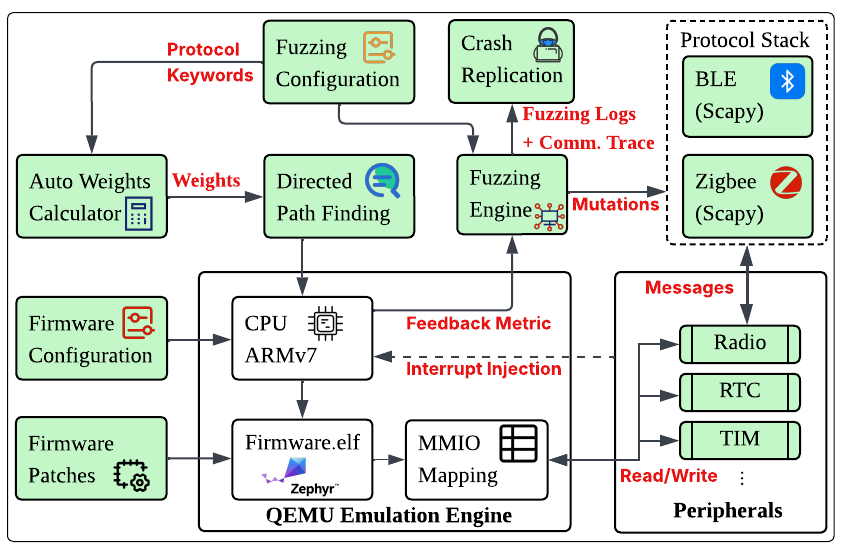

# aIRQFuzz (BLE) - QEMU Directed Firmware Protocol Fuzzer
An emulation-based, directed fuzzing framework that automatically discovers vulnerabilities deep into the wireless protocol implementation of bare-metal firmware. We evaluate aIRQFuzz on two distinct targets (BLE and Zigbee) to demonstrate both its effectiveness and its extensibility.  aIRQFuzz opens possibilities for emulation-based and stateful fuzzing of complex wireless protocols.

<p align="center">
  
</p>

------

**Table of Contents**

1. [📋 Software Environment](#1--software-environment)
2. [⏩ Initial Compilation](#2--initial-compilation)
3. [🔀 Running Emulation Exploriation](#3--running-emulation-exploriation)
    * [Target Firmware Ble](#31-target-firmware-ble)
    * [Target Config Ble](#32-target-config-ble)
    * [Target Patch Ble](#33-target-patch-ble)
4. [🧑‍💻 Input Runner](#4--input-runner)
    * [Run single input](#41-run-single-input)
    * [Run single input with mmio/ram access documented](#42-run-single-input-with-mmio-ram-access-documented)
    * [Emulation input](#43-emulation-input)
5. [📄 Running the fuzzer](#5--running-the-fuzzer)
    * [Customised U-fuzz docker image](#51-customised-u-fuzz-docker-image)
    * [Running Totural](#52-running-totural)
6. [📄 Exploits](#6--exploits)
    * [Summary of potential Crashes](#61-summary-of-potential-crashes)
    * [Available Exploits](#62-available-exploits)
    * [Real board replication](#63-real-board-replication)
    * [Emulation replication](#64-emulation-replication)
7. [🧑‍💻 PoC script Auto-generator](#7--poc-script-auto-generator)
    * [Running Toturials and Potential Issues](#71-running-toturials-and-potential-issues)
8. [🧑‍💻 Auto-Weight calculator](#8--auto-weight-calculator)
    * [Running Toturials and Potential Issues](#81-running-toturials-and-potential-issues)
9. [📝 Citing aIRQFuzz](#9--citing-airqfuzz)


------

# 1. 📋 Software Environment
* **OS:** Ubuntu 24.04 - We recommend using Ubuntu 24.04 to build and run the emualtion engine for aIRQFuzz. As for the fuzzing engine, we prepared a ready-to-run docker [container](#51-customised-u-fuzz-docker-image) which build on ubuntu-18.04.  Alternativelly, you can refer to [U-fuzz]([url](https://github.com/asset-group/U-Fuzz/blob/main/README.md#2--initial-compilation)) github repo for environment setup to ensure the correct OS environment.

# 2. ⏩ Initial Compilation 
Several requirements need to be installed before compiling the project. An automated script for Ubuntu 24.04 is provided on `requirements.sh`. To compile from source, simply run the following commands:
```
$ Download the content from this github link:
https://anonymous.4open.science/r/AIRQFuzz_ZBE/

$ cd aIRQFuzz_ble

$ ./requirements.sh # Create a python virtual environment and Install all requirements to compile emulator from source 

$ cargo build # Compile all binaries. It may take around 15min. Go get a coffe!
```

# 3. 🔀 Running Emulation Exploriation
Before running the emulation engine three inputs need to be provided as follows:

1: Target Firmware Binary and Elf

2: Target configuration which specifies the memmory layout for the target firmware, the exithook function list and Interrupt Injection method.

3: Customised Patch for Target whcih contains the necessary patch for advancing the emulation to protocol code space.

After compiling the project with the correct software environment, please run the following command
```
$ cd qpfuzzer_ble

target fodler was specified in fuzz.sh
$ ./fuzz.sh
```
The emulation log would be saved in the target fodler under name log-fuzzing.txt
<!-- ## 3.1 Target Firmware BLE
[Target Fimware BLE](TODO)
## 3.2 Target Config BLE
## 3.3 Target Patch BLE -->
## 3.1 Target Firmware BLE
[Ble binary](./target-zephyr/firmwire/)
[Ble elf](./target-zephyr/firmwire/)
## 3.2 Target Config BLE
[Ble config](./target-zephyr/config_multi_version/)
## 3.3 Target Patch BLE
[Ble patch](./target-zephyr/hook_multi_version/)
[Ble patch for fuzzing](./target-zephyr/hook_multi_version/)

# 4. 🧑‍💻 Input Runner
Once meaningful emulation session has been done. a corpus archive file will be saved at target_folder/runs directory. After un-tar it, individual file could be retrieved.

<!-- See help for detials:
```
cargo run --bin hoedur-arm -- fuzz --help
``` -->

## 4.1 Run single input
The following cmd could be used to run single input
```
$ cd qpfuzzer_ble

$ ./run-input.sh <input.bin>
```

## 4.2 Run single input with mmio/ram access documented
The following cmd could be used to run single input
```
$ cd qpfuzzer_ble

$ ./run-input-detail.sh <input.bin>
```

## 4.3 Emulation input
[Individual input Ble](./target-zephyr/meaningful_input_multi_version/)

# 5. 📄 Running the fuzzer
## 5.1 Customised U-fuzz docker image
*Can pull from docker hub*
```
docker pull airqfuzz/u-fuzz-docker:aIRQFuzz
```
## 5.2 Running Totural
**Step1:**
*build the project (ble_realtime_fuzzer)*

```
Edit the CMakeLists.txt
$ Comments line:802, 811-815 
  (`set(ZIGBEE_SRC src/zigbee_realtime_fuzzer.cpp libs/shared_memory.c)`)
  (`add_executable(zigbee_realtime_fuzzer ${ZIGBEE_SRC} libs/profiling.c)`)
  (`target_link_libraries(zigbee_realtime_fuzzer PRIVATE ${MINIMAL_FUZZER_LIBS} viface)`)
  (`target_compile_options(zigbee_realtime_fuzzer PRIVATE -w -O0)`)
  (`target_compile_definitions(zigbee_realtime_fuzzer PRIVATE -DFUZZ_WIFI_AP)`)

$ Uncomments line: 806, 825-829 which were configured for Ble fuzzing
  (set(BLE_SRC src/ble_realtime_fuzzer.cpp libs/shared_memory.c))
  (add_executable(ble_realtime_fuzzer ${BLE_SRC} libs/profiling.c))
  (target_link_libraries(ble_realtime_fuzzer PRIVATE ${MINIMAL_FUZZER_LIBS} viface))
  (target_compile_options(ble_realtime_fuzzer PRIVATE -w -O0))
  (target_compile_definitions(ble_realtime_fuzzer PRIVATE -DFUZZ_WIFI_AP))

$ ./build.sh all

```
**Step2:**
*Update the fuzzing config if needed*
```
$ sudo nano /home/user/U-Fuzz/configs/ble_config.json
```
set enable_mutation == true and enable_optimization == true to enable stateful protocol aware fuzzing

**Step3:**
*Running the fuzzer*
```
$ cd /home/user/U-Fuzz

$ sudo bin/ble_realtime_fuzzer
```
The fuzzing probability, max fuzzing time and max iteration could also be updated in the config file. More detials could be found in [U-fuzz repo]([url](https://github.com/asset-group/U-Fuzz/))

**Step4:**
*Replay the emulation single input  at aIRQFuzz*
```
$ cd ~/qpfuzer_ble

$ ./run-input-loop.sh <input.bin>
```
[Potential input](#43-emulation-input) were provided
**potential cmd:**
```
./run-input-loop.sh ./target-zephyr/meaningful_input_multi_version/v350/sm_pairing_req_good350_ss2.bin
```
 
For fuzzing the emulation, the fuzzing engine needs to be conencted with the emulation engine to intercept the communication. [Ble patch for fuzzing](./target-zephyr/hook.rs) was required instead of 
[Ble patch](./target-zephyr/hook_without_fuzzer.rs).


# 6. 📄 Exploits
## 6.1.  Summary of potential Crashes:
To this day, aIRQFUZZ has found 96 potential crashes in the BLE implementation of Zephyr OS across multiple versions and 27 potential crashes in Zephyr/Nordic Zigbee implementation. 
### QPF effectiveness to find/replicate crashes

| Protocol | Fw. Version                  | Unique Crash | # Mutations | Potential Crash | Board Replication |
|----------|------------------------------|--------------|-------------|-----------------|-------------------|
| **BLE**  | V2.2.99                      | 78           | ≤ 3         | 68              | 2 (CVE-2020-10061, CVE-2020-10069) |
|          | V2.5.1                       | 2            | ≤ 3         | 2               | 0                 |
|          | V3.5.99                      | 5            | ≤ 3         | 5               | 1                 |
|          | V3.7.1                       | 18           | ≤ 2         | 11              | 1 (duplicate to V3.5) |
|          | V4.0.0                       | 13           | ≤ 3         | 10              | 1 (duplicate to V3.5) |
| **Total**| All versions                 | 116          | ≤ 3         | 96              | 3                 |
| **Zigbee** | Nordic V2.9.99 + Zephyr OS V3.7.9 | 27   | ≤ 5         | 27              | NA                |


## 6.2. Available Exploits
### BLE v2.2.99 Exploits
| Vulnerability Name | Exploit |
| --- | --- |
| t1_1_connect_ind | [t1_1_connect_ind.cpp](./target-zephyr/ble_exploits_multi_version/ble_v220/t1_1_connect_ind.cpp) |
| t1_4_connect_ind | [t1_4_connect_ind.cpp](./target-zephyr/ble_exploits_multi_version/ble_v220/t1_4_connect_ind.cpp) |
| t1_6_sent_exchange_mtu_request_client_rx_mtu_247 | [t1_6_sent_exchange_mtu_request_client_rx_mtu_247.cpp](./target-zephyr/ble_exploits_multi_version/ble_v220/t1_6_sent_exchange_mtu_request_client_rx_mtu_247.cpp) |
| t1_9_sent_exchange_mtu_request_client_rx_mtu_247 | [t1_9_sent_exchange_mtu_request_client_rx_mtu_247.cpp](./target-zephyr/ble_exploits_multi_version/ble_v220/t1_9_sent_exchange_mtu_request_client_rx_mtu_247.cpp) |
| t1_10_ll_version_ind | [t1_10_ll_version_ind.cpp](./target-zephyr/ble_exploits_multi_version/ble_v220/t1_10_ll_version_ind.cpp) |
| t1_11_ll_version_ind | [t1_11_ll_version_ind.cpp](./target-zephyr/ble_exploits_multi_version/ble_v220/t1_11_ll_version_ind.cpp) |
| t1_12_ll_feature_req | [t1_12_ll_feature_req.cpp](./target-zephyr/ble_exploits_multi_version/ble_v220/t1_12_ll_feature_req.cpp) |
| t1_13_ll_feature_req | [t1_13_ll_feature_req.cpp](./target-zephyr/ble_exploits_multi_version/ble_v220/t1_13_ll_feature_req.cpp) |
| t1_14_ll_length_req | [t1_14_ll_length_req.cpp](./target-zephyr/ble_exploits_multi_version/ble_v220/t1_14_ll_length_req.cpp) |
| t1_24_ll_feature_req | [t1_24_ll_feature_req.cpp](./target-zephyr/ble_exploits_multi_version/ble_v220/t1_24_ll_feature_req.cpp) |
| t1_26_connect_ind | [t1_26_connect_ind.cpp](./target-zephyr/ble_exploits_multi_version/ble_v220/t1_26_connect_ind.cpp) |
| t1_27_connect_ind | [t1_27_connect_ind.cpp](./target-zephyr/ble_exploits_multi_version/ble_v220/t1_27_connect_ind.cpp) |
| t1_28_connect_ind | [t1_28_connect_ind.cpp](./target-zephyr/ble_exploits_multi_version/ble_v220/t1_28_connect_ind.cpp) |
| t1_29_connect_ind | [t1_29_connect_ind.cpp](./target-zephyr/ble_exploits_multi_version/ble_v220/t1_29_connect_ind.cpp) |
| t2_1_ll_version_ind | [t2_1_ll_version_ind.cpp](./target-zephyr/ble_exploits_multi_version/ble_v220/t2_1_ll_version_ind.cpp) |
| t2_1_sent_exchange_mtu_request_client_rx_mtu_247 | [t2_1_sent_exchange_mtu_request_client_rx_mtu_247.cpp](./target-zephyr/ble_exploits_multi_version/ble_v220/t2_1_sent_exchange_mtu_request_client_rx_mtu_247.cpp) |
| t2_4_sent_exchange_mtu_request_client_rx_mtu_247 | [t2_4_sent_exchange_mtu_request_client_rx_mtu_247.cpp](./target-zephyr/ble_exploits_multi_version/ble_v220/t2_4_sent_exchange_mtu_request_client_rx_mtu_247.cpp) |
| t2_5_sent_exchange_mtu_request_client_rx_mtu_247 | [t2_5_sent_exchange_mtu_request_client_rx_mtu_247.cpp](./target-zephyr/ble_exploits_multi_version/ble_v220/t2_5_sent_exchange_mtu_request_client_rx_mtu_247.cpp) |
| t2_6_sent_exchange_mtu_request_client_rx_mtu_247 | [t2_6_sent_exchange_mtu_request_client_rx_mtu_247.cpp](./target-zephyr/ble_exploits_multi_version/ble_v220/t2_6_sent_exchange_mtu_request_client_rx_mtu_247.cpp) |
| t2_7_ll_length_req | [t2_7_ll_length_req.cpp](./target-zephyr/ble_exploits_multi_version/ble_v220/t2_7_ll_length_req.cpp) |
| t2_7_sent_exchange_mtu_request_client_rx_mtu_247 | [t2_7_sent_exchange_mtu_request_client_rx_mtu_247.cpp](./target-zephyr/ble_exploits_multi_version/ble_v220/t2_7_sent_exchange_mtu_request_client_rx_mtu_247.cpp) |
| t2_8_ll_length_req | [t2_8_ll_length_req.cpp](./target-zephyr/ble_exploits_multi_version/ble_v220/t2_8_ll_length_req.cpp) |
| t2_8_ll_version_ind | [t2_8_ll_version_ind.cpp](./target-zephyr/ble_exploits_multi_version/ble_v220/t2_8_ll_version_ind.cpp) |
| t2_9_ll_length_req | [t2_9_ll_length_req.cpp](./target-zephyr/ble_exploits_multi_version/ble_v220/t2_9_ll_length_req.cpp) |
| t2_9_ll_version_ind | [t2_9_ll_version_ind.cpp](./target-zephyr/ble_exploits_multi_version/ble_v220/t2_9_ll_version_ind.cpp) |
| t2_9_sent_exchange_mtu_request_client_rx_mtu_247 | [t2_9_sent_exchange_mtu_request_client_rx_mtu_247.cpp](./target-zephyr/ble_exploits_multi_version/ble_v220/t2_9_sent_exchange_mtu_request_client_rx_mtu_247.cpp) |
| t2_10_ll_length_req | [t2_10_ll_length_req.cpp](./target-zephyr/ble_exploits_multi_version/ble_v220/t2_10_ll_length_req.cpp) |
| t2_10_ll_version_ind | [t2_10_ll_version_ind.cpp](./target-zephyr/ble_exploits_multi_version/ble_v220/t2_10_ll_version_ind.cpp) |
| t2_11_ll_feature_req | [t2_11_ll_feature_req.cpp](./target-zephyr/ble_exploits_multi_version/ble_v220/t2_11_ll_feature_req.cpp) |
| t2_11_ll_length_req | [t2_11_ll_length_req.cpp](./target-zephyr/ble_exploits_multi_version/ble_v220/t2_11_ll_length_req.cpp) |
| t2_11_ll_version_ind | [t2_11_ll_version_ind.cpp](./target-zephyr/ble_exploits_multi_version/ble_v220/t2_11_ll_version_ind.cpp) |
| t2_12_ll_feature_req | [t2_12_ll_feature_req.cpp](./target-zephyr/ble_exploits_multi_version/ble_v220/t2_12_ll_feature_req.cpp) |
| t2_12_ll_length_req | [t2_12_ll_length_req.cpp](./target-zephyr/ble_exploits_multi_version/ble_v220/t2_12_ll_length_req.cpp) |
| t2_13_ll_feature_req | [t2_13_ll_feature_req.cpp](./target-zephyr/ble_exploits_multi_version/ble_v220/t2_13_ll_feature_req.cpp) |
| t2_13_sent_exchange_mtu_request_client_rx_mtu_247 | [t2_13_sent_exchange_mtu_request_client_rx_mtu_247.cpp](./target-zephyr/ble_exploits_multi_version/ble_v220/t2_13_sent_exchange_mtu_request_client_rx_mtu_247.cpp) |
| t2_14_ll_feature_req | [t2_14_ll_feature_req.cpp](./target-zephyr/ble_exploits_multi_version/ble_v220/t2_14_ll_feature_req.cpp) |
| t2_14_ll_length_req | [t2_14_ll_length_req.cpp](./target-zephyr/ble_exploits_multi_version/ble_v220/t2_14_ll_length_req.cpp) |
| t2_14_sent_exchange_mtu_request_client_rx_mtu_247 | [t2_14_sent_exchange_mtu_request_client_rx_mtu_247.cpp](./target-zephyr/ble_exploits_multi_version/ble_v220/t2_14_sent_exchange_mtu_request_client_rx_mtu_247.cpp) |
| t2_24_ll_feature_req | [t2_24_ll_feature_req.cpp](./target-zephyr/ble_exploits_multi_version/ble_v220/t2_24_ll_feature_req.cpp) |
| t3_1_ll_version_ind | [t3_1_ll_version_ind.cpp](./target-zephyr/ble_exploits_multi_version/ble_v220/t3_1_ll_version_ind.cpp) |
| t3_1_sent_exchange_mtu_request_client_rx_mtu_247 | [t3_1_sent_exchange_mtu_request_client_rx_mtu_247.cpp](./target-zephyr/ble_exploits_multi_version/ble_v220/t3_1_sent_exchange_mtu_request_client_rx_mtu_247.cpp) |
| t3_2_ll_version_ind | [t3_2_ll_version_ind.cpp](./target-zephyr/ble_exploits_multi_version/ble_v220/t3_2_ll_version_ind.cpp) |
| t3_3_sent_exchange_mtu_request_client_rx_mtu_247 | [t3_3_sent_exchange_mtu_request_client_rx_mtu_247.cpp](./target-zephyr/ble_exploits_multi_version/ble_v220/t3_3_sent_exchange_mtu_request_client_rx_mtu_247.cpp) |
| t3_4_ll_version_ind | [t3_4_ll_version_ind.cpp](./target-zephyr/ble_exploits_multi_version/ble_v220/t3_4_ll_version_ind.cpp) |
| t3_4_sent_exchange_mtu_request_client_rx_mtu_247 | [t3_4_sent_exchange_mtu_request_client_rx_mtu_247.cpp](./target-zephyr/ble_exploits_multi_version/ble_v220/t3_4_sent_exchange_mtu_request_client_rx_mtu_247.cpp) |
| t3_4_sent_pairing_request_authreq_bonding_secureconnection__initiator_keys_ltk_irk_csrk__responder_keys_ltk_irk_csrk | [t3_4_sent_pairing_request_authreq_bonding_secureconnection__initiator_keys_ltk_irk_csrk__responder_keys_ltk_irk_csrk.cpp](./target-zephyr/ble_exploits_multi_version/ble_v220/t3_4_sent_pairing_request_authreq_bonding_secureconnection__initiator_keys_ltk_irk_csrk__responder_keys_ltk_irk_csrk.cpp) |
| t3_5_ll_length_req | [t3_5_ll_length_req.cpp](./target-zephyr/ble_exploits_multi_version/ble_v220/t3_5_ll_length_req.cpp) |
| t3_5_ll_version_ind | [t3_5_ll_version_ind.cpp](./target-zephyr/ble_exploits_multi_version/ble_v220/t3_5_ll_version_ind.cpp) |
| t3_5_sent_exchange_mtu_request_client_rx_mtu_247 | [t3_5_sent_exchange_mtu_request_client_rx_mtu_247.cpp](./target-zephyr/ble_exploits_multi_version/ble_v220/t3_5_sent_exchange_mtu_request_client_rx_mtu_247.cpp) |
| t3_6_ll_length_req | [t3_6_ll_length_req.cpp](./target-zephyr/ble_exploits_multi_version/ble_v220/t3_6_ll_length_req.cpp) |
| t3_6_ll_version_ind | [t3_6_ll_version_ind.cpp](./target-zephyr/ble_exploits_multi_version/ble_v220/t3_6_ll_version_ind.cpp) |
| t3_6_sent_exchange_mtu_request_client_rx_mtu_247 | [t3_6_sent_exchange_mtu_request_client_rx_mtu_247.cpp](./target-zephyr/ble_exploits_multi_version/ble_v220/t3_6_sent_exchange_mtu_request_client_rx_mtu_247.cpp) |
| t3_7_ll_length_req | [t3_7_ll_length_req.cpp](./target-zephyr/ble_exploits_multi_version/ble_v220/t3_7_ll_length_req.cpp) |
| t3_7_ll_version_ind | [t3_7_ll_version_ind.cpp](./target-zephyr/ble_exploits_multi_version/ble_v220/t3_7_ll_version_ind.cpp) |
| t3_7_sent_exchange_mtu_request_client_rx_mtu_247 | [t3_7_sent_exchange_mtu_request_client_rx_mtu_247.cpp](./target-zephyr/ble_exploits_multi_version/ble_v220/t3_7_sent_exchange_mtu_request_client_rx_mtu_247.cpp) |
| t3_8_ll_length_req | [t3_8_ll_length_req.cpp](./target-zephyr/ble_exploits_multi_version/ble_v220/t3_8_ll_length_req.cpp) |
| t3_8_ll_version_ind | [t3_8_ll_version_ind.cpp](./target-zephyr/ble_exploits_multi_version/ble_v220/t3_8_ll_version_ind.cpp) |
| t3_8_sent_exchange_mtu_request_client_rx_mtu_247 | [t3_8_sent_exchange_mtu_request_client_rx_mtu_247.cpp](./target-zephyr/ble_exploits_multi_version/ble_v220/t3_8_sent_exchange_mtu_request_client_rx_mtu_247.cpp) |
| t3_8_sent_pairing_request_authreq_bonding_secureconnection__initiator_keys_ltk_irk_csrk__responder_keys_ltk_irk_csrk | [t3_8_sent_pairing_request_authreq_bonding_secureconnection__initiator_keys_ltk_irk_csrk__responder_keys_ltk_irk_csrk.cpp](./target-zephyr/ble_exploits_multi_version/ble_v220/t3_8_sent_pairing_request_authreq_bonding_secureconnection__initiator_keys_ltk_irk_csrk__responder_keys_ltk_irk_csrk.cpp) |
| t3_9_ll_length_req | [t3_9_ll_length_req.cpp](./target-zephyr/ble_exploits_multi_version/ble_v220/t3_9_ll_length_req.cpp) |
| t3_9_ll_version_ind | [t3_9_ll_version_ind.cpp](./target-zephyr/ble_exploits_multi_version/ble_v220/t3_9_ll_version_ind.cpp) |
| t3_9_sent_exchange_mtu_request_client_rx_mtu_247 | [t3_9_sent_exchange_mtu_request_client_rx_mtu_247.cpp](./target-zephyr/ble_exploits_multi_version/ble_v220/t3_9_sent_exchange_mtu_request_client_rx_mtu_247.cpp) |
| t3_10_ll_length_req | [t3_10_ll_length_req.cpp](./target-zephyr/ble_exploits_multi_version/ble_v220/t3_10_ll_length_req.cpp) |
| t3_10_ll_version_ind | [t3_10_ll_version_ind.cpp](./target-zephyr/ble_exploits_multi_version/ble_v220/t3_10_ll_version_ind.cpp) |
| t3_11_ll_length_req | [t3_11_ll_length_req.cpp](./target-zephyr/ble_exploits_multi_version/ble_v220/t3_11_ll_length_req.cpp) |
| t3_11_ll_version_ind | [t3_11_ll_version_ind.cpp](./target-zephyr/ble_exploits_multi_version/ble_v220/t3_11_ll_version_ind.cpp) |
| t3_11_sent_exchange_mtu_request_client_rx_mtu_247 | [t3_11_sent_exchange_mtu_request_client_rx_mtu_247.cpp](./target-zephyr/ble_exploits_multi_version/ble_v220/t3_11_sent_exchange_mtu_request_client_rx_mtu_247.cpp) |
| t3_12_ll_length_req | [t3_12_ll_length_req.cpp](./target-zephyr/ble_exploits_multi_version/ble_v220/t3_12_ll_length_req.cpp) |
| t3_13_ll_version_ind | [t3_13_ll_version_ind.cpp](./target-zephyr/ble_exploits_multi_version/ble_v220/t3_13_ll_version_ind.cpp) |
| t3_13_sent_exchange_mtu_request_client_rx_mtu_247 | [t3_13_sent_exchange_mtu_request_client_rx_mtu_247.cpp](./target-zephyr/ble_exploits_multi_version/ble_v220/t3_13_sent_exchange_mtu_request_client_rx_mtu_247.cpp) |
| t3_14_sent_exchange_mtu_request_client_rx_mtu_247 | [t3_14_sent_exchange_mtu_request_client_rx_mtu_247.cpp](./target-zephyr/ble_exploits_multi_version/ble_v220/t3_14_sent_exchange_mtu_request_client_rx_mtu_247.cpp) |
| t3_15_sent_exchange_mtu_request_client_rx_mtu_247 | [t3_15_sent_exchange_mtu_request_client_rx_mtu_247.cpp](./target-zephyr/ble_exploits_multi_version/ble_v220/t3_15_sent_exchange_mtu_request_client_rx_mtu_247.cpp) |
| t3_18_sent_exchange_mtu_request_client_rx_mtu_247 | [t3_18_sent_exchange_mtu_request_client_rx_mtu_247.cpp](./target-zephyr/ble_exploits_multi_version/ble_v220/t3_18_sent_exchange_mtu_request_client_rx_mtu_247.cpp) |
| t3_25_ll_length_req | [t3_25_ll_length_req.cpp](./target-zephyr/ble_exploits_multi_version/ble_v220/t3_25_ll_length_req.cpp) |
| t3_27_ll_version_ind | [t3_27_ll_version_ind.cpp](./target-zephyr/ble_exploits_multi_version/ble_v220/t3_27_ll_version_ind.cpp) |

### BLE v2.5.0 Exploits
| Vulnerability Name | Exploit |
| --- | --- |
| t1_2_connect_ind | [t1_2_connect_ind.cpp](./target-zephyr/ble_exploits_multi_version/ble_v250/t1_2_connect_ind.cpp) |
| t1_3_connect_ind | [t1_3_connect_ind.cpp](./target-zephyr/ble_exploits_multi_version/ble_v250/t1_3_connect_ind.cpp) |

### BLE v3.5.0 Exploits
| Vulnerability Name | Exploit |
| --- | --- |
| t1_8_ll_version_ind | [t1_8_ll_version_ind.cpp](./target-zephyr/ble_exploits_multi_version/ble_v350/t1_8_ll_version_ind.cpp) |
| t1_11_ll_length_req | [t1_11_ll_length_req.cpp](./target-zephyr/ble_exploits_multi_version/ble_v350/t1_11_ll_length_req.cpp) |
| t2_5_rcvd_pairing_request_authreq_bonding_secureconnection__initiator_keys_ltk_irk_csrk__responder_keys_ltk_irk_csrk | [t2_5_rcvd_pairing_request_authreq_bonding_secureconnection__initiator_keys_ltk_irk_csrk__responder_keys_ltk_irk_csrk.cpp](./target-zephyr/ble_exploits_multi_version/ble_v350/t2_5_rcvd_pairing_request_authreq_bonding_secureconnection__initiator_keys_ltk_irk_csrk__responder_keys_ltk_irk_csrk.cpp) |
| t2_6_ll_version_ind | [t2_6_ll_version_ind.cpp](./target-zephyr/ble_exploits_multi_version/ble_v350/t2_6_ll_version_ind.cpp) |
| t2_8_ll_length_req | [t2_8_ll_length_req.cpp](./target-zephyr/ble_exploits_multi_version/ble_v350/t2_8_ll_length_req.cpp) |
| t2_8_ll_version_ind | [t2_8_ll_version_ind.cpp](./target-zephyr/ble_exploits_multi_version/ble_v350/t2_8_ll_version_ind.cpp) |
| t2_9_ll_length_req | [t2_9_ll_length_req.cpp](./target-zephyr/ble_exploits_multi_version/ble_v350/t2_9_ll_length_req.cpp) |
| t2_11_ll_length_req | [t2_11_ll_length_req.cpp](./target-zephyr/ble_exploits_multi_version/ble_v350/t2_11_ll_length_req.cpp) |
| t3_5_ll_version_ind | [t3_5_ll_version_ind.cpp](./target-zephyr/ble_exploits_multi_version/ble_v350/t3_5_ll_version_ind.cpp) |
| t3_6_ll_version_ind | [t3_6_ll_version_ind.cpp](./target-zephyr/ble_exploits_multi_version/ble_v350/t3_6_ll_version_ind.cpp) |
| t3_8_ll_version_ind | [t3_8_ll_version_ind.cpp](./target-zephyr/ble_exploits_multi_version/ble_v350/t3_8_ll_version_ind.cpp) |

### BLE v3.7.1 Exploits
| Vulnerability Name | Exploit |
| --- | --- |
| t1_2_connect_ind | [t1_2_connect_ind.cpp](./target-zephyr/ble_exploits_multi_version/ble_v371/t1_2_connect_ind.cpp) |
| t1_2_ll_feature_req | [t1_2_ll_feature_req.cpp](./target-zephyr/ble_exploits_multi_version/ble_v371/t1_2_ll_feature_req.cpp) |
| t1_3_ll_feature_req | [t1_3_ll_feature_req.cpp](./target-zephyr/ble_exploits_multi_version/ble_v371/t1_3_ll_feature_req.cpp) |
| t1_4_connect_ind | [t1_4_connect_ind.cpp](./target-zephyr/ble_exploits_multi_version/ble_v371/t1_4_connect_ind.cpp) |
| t1_5_connect_ind | [t1_5_connect_ind.cpp](./target-zephyr/ble_exploits_multi_version/ble_v371/t1_5_connect_ind.cpp) |
| t1_5_ll_feature_req | [t1_5_ll_feature_req.cpp](./target-zephyr/ble_exploits_multi_version/ble_v371/t1_5_ll_feature_req.cpp) |
| t1_33_ll_feature_req | [t1_33_ll_feature_req.cpp](./target-zephyr/ble_exploits_multi_version/ble_v371/t1_33_ll_feature_req.cpp) |
| t1_36_ll_feature_req | [t1_36_ll_feature_req.cpp](./target-zephyr/ble_exploits_multi_version/ble_v371/t1_36_ll_feature_req.cpp) |
| t2_2_ll_feature_req | [t2_2_ll_feature_req.cpp](./target-zephyr/ble_exploits_multi_version/ble_v371/t2_2_ll_feature_req.cpp) |
| t2_3_ll_feature_req | [t2_3_ll_feature_req.cpp](./target-zephyr/ble_exploits_multi_version/ble_v371/t2_3_ll_feature_req.cpp) |
| t2_5_ll_feature_req | [t2_5_ll_feature_req.cpp](./target-zephyr/ble_exploits_multi_version/ble_v371/t2_5_ll_feature_req.cpp) |
| t2_8_ll_length_req | [t2_8_ll_length_req.cpp](./target-zephyr/ble_exploits_multi_version/ble_v371/t2_8_ll_length_req.cpp) |
| t2_9_ll_feature_req | [t2_9_ll_feature_req.cpp](./target-zephyr/ble_exploits_multi_version/ble_v371/t2_9_ll_feature_req.cpp) |
| t2_32_ll_feature_req | [t2_32_ll_feature_req.cpp](./target-zephyr/ble_exploits_multi_version/ble_v371/t2_32_ll_feature_req.cpp) |
| t2_33_ll_feature_req | [t2_33_ll_feature_req.cpp](./target-zephyr/ble_exploits_multi_version/ble_v371/t2_33_ll_feature_req.cpp) |
| t2_34_ll_feature_req | [t2_34_ll_feature_req.cpp](./target-zephyr/ble_exploits_multi_version/ble_v371/t2_34_ll_feature_req.cpp) |
| t2_35_ll_feature_req | [t2_35_ll_feature_req.cpp](./target-zephyr/ble_exploits_multi_version/ble_v371/t2_35_ll_feature_req.cpp) |

### BLE v4.1.0 Exploits
| Vulnerability Name | Exploit |
| --- | --- |
| t1_10_ll_length_req | [t1_10_ll_length_req.cpp](./target-zephyr/ble_exploits_multi_version/ble_v410/t1_10_ll_length_req.cpp) |
| t1_11_ll_length_req | [t1_11_ll_length_req.cpp](./target-zephyr/ble_exploits_multi_version/ble_v410/t1_11_ll_length_req.cpp) |
| t1_12_ll_feature_req | [t1_12_ll_feature_req.cpp](./target-zephyr/ble_exploits_multi_version/ble_v410/t1_12_ll_feature_req.cpp) |
| t1_14_ll_feature_req | [t1_14_ll_feature_req.cpp](./target-zephyr/ble_exploits_multi_version/ble_v410/t1_14_ll_feature_req.cpp) |
| t1_14_sent_exchange_mtu_request_client_rx_mtu_247 | [t1_14_sent_exchange_mtu_request_client_rx_mtu_247.cpp](./target-zephyr/ble_exploits_multi_version/ble_v410/t1_14_sent_exchange_mtu_request_client_rx_mtu_247.cpp) |
| t2_3_ll_version_ind | [t2_3_ll_version_ind.cpp](./target-zephyr/ble_exploits_multi_version/ble_v410/t2_3_ll_version_ind.cpp) |
| t2_6_ll_length_req | [t2_6_ll_length_req.cpp](./target-zephyr/ble_exploits_multi_version/ble_v410/t2_6_ll_length_req.cpp) |
| t2_9_ll_length_req | [t2_9_ll_length_req.cpp](./target-zephyr/ble_exploits_multi_version/ble_v410/t2_9_ll_length_req.cpp) |
| t2_10_ll_length_req | [t2_10_ll_length_req.cpp](./target-zephyr/ble_exploits_multi_version/ble_v410/t2_10_ll_length_req.cpp) |
| t2_11_ll_length_req | [t2_11_ll_length_req.cpp](./target-zephyr/ble_exploits_multi_version/ble_v410/t2_11_ll_length_req.cpp) |
| t2_12_ll_feature_req | [t2_12_ll_feature_req.cpp](./target-zephyr/ble_exploits_multi_version/ble_v410/t2_12_ll_feature_req.cpp) |
| t3_4_ll_length_req | [t3_4_ll_length_req.cpp](./target-zephyr/ble_exploits_multi_version/ble_v410/t3_4_ll_length_req.cpp) |
| t3_10_ll_length_req | [t3_10_ll_length_req.cpp](./target-zephyr/ble_exploits_multi_version/ble_v410/t3_10_ll_length_req.cpp) |

## 6.3. Real board replication
Our group used nrf52840DK board to verify the potential crash on the real board.
To launch such attack, please follow the attack tutorial that vakt-ble provided in section [4.1 Launching Sweyntooth Attacks](https://github.com/asset-group/vakt-ble-defender?tab=readme-ov-file#41-launching-sweyntooth-attacks)
### 6.3.1. Realboard crash script
TODO

## 6.4. Emulation replication
Emulation replication requires the auto-generated [PoC scripts](#62-available-exploits) running by the fuzzing engine to replay the crash sequence. Both the enable_mutation and enable_optimization need to be set to false to eliminate the normal mutation operation.
The detailed emulation replication [toturial](./toturial/emulation_replication_toturial.html) was provided.
<!-- Add a file for toturial -->

# 7. 🧑‍💻 PoC script Auto-generator
## 7.1 Running Toturials and Potential Issues

# 8. 🧑‍💻 Auto Weight calculator
## 8.1 Running Toturials and Potential Issues


# 9. 📝 Citing aIRQFuzz

```
Todo
```


<!-- 
Todo:
1. finished the fuzzing docker (separete ble and zigbee)
2. Update the ## 5.2 Running Totural
3. output the docker
4. realboard replication script
6. Finished the PoC generator part
7. Make sure the anonymouse
 -->
